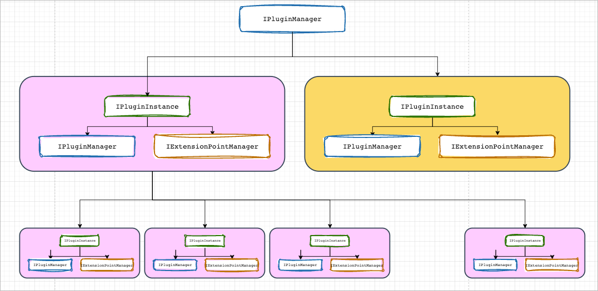

# 插件
## 插件
类似于`maven`,`npm`等插件/包管理器的设计思路,可以通过三个坐标值来全球唯一的标识一个插件.
- `group` 插件所属的组织,理论上最好使用组织使用的域名
- `name` 插件的名称
- `version` 插件的语义化版本
所以,一个最简单的插件可以被描述为:
```json
{
  "name": "cat-man-plugin-examples-plugins",
  "group": "cc.catman.plugin",
  "version": "1.0.8"
}
```


## 插件管理器
在设计上,一个插件由三个核心部分构成:
- 插件管理器
- 插件
- 扩展点管理器

其中插件管理器用于管理插件实例,一个插件管理器可以管理多个插件实例.

一个插件实例由一个插件管理器和一个扩展点管理器构成,其中插件管理器用于管理**由该插件创建**或**由其他插件交给当前插件**
管理的所有插件实例,扩展点管理器则负责管理该插件所持有的扩展点信息.

他们之间的简单结构如下图:


由上图可以看到,最顶层的插件管理器没有所属的插件实例,他是独立存在的,仅用于作为整个插件管理体系的最初入口.

## 插件的生命周期
插件的生命周期被定义在`ELifeCycle.java`文件中,目前预制的生命周期如下:

```text
    UNKNOWN,    // 未知,不知道当前插件处于什么状态
    ANALYZE,    // 分析插件的类型,这是很重要的一步,需要在有限的数据内,迅速判断插件应该转换为何种状态,比如,只给了GAV坐标,没有其他数据,那么这就是一个ACHIEVE类型的描述信息
    ACHIEVE,    // 获取,获取插件数据,通常有插件市场组件来实现
    COMPILE,    // 编译,如果插件是源码的形式,需要进行编译操作
    BUILD,      // 构建,编译完成后,需要将编译产物,构建成插件,jar,war,zip,tar之类的
    SEARCH,     // 寻找插件的描述文件
    PARSE,      // 解析,解析插件的描述信息,生成插件解析信息
    VERIFY,     // 验证,一系列验证器验证插件是否可用
    PRE_LOAD,   // 插件的前期准备工作,准备插件加载时所需的必要项,比如,解析第三方依赖,并进行存储工作.或者是解压ZIP包(如果需要)
    LOAD,       // 当常见通过验证,Load组件将会根据插件信息,生成最终的插件实例,并将其注册到对应的插件管理器中.
    AFTER_LOAD, // 当插件加载完成后,调用,目前能够想到的场景就是处理插件依赖
    FINISHED,   // 已完成
```
用户可以根据自己的需要动态的去注册自己的生命周期以及相关的处理器.

`IPluginConfiguration#getParsingProcessProcessorFactory`所返回的工厂实例用于创建`IParsingProcessProcessor`实例.

`IParsingProcessProcessor`中的下面方法可以用于注册新的生命周期:
```java
boolean first(String lifeCycle);

boolean last(String lifeCycle);

boolean beforeLifeCycles(String lifeCycle,String before);

boolean afterLifeCycles(String lifeCycle,String after);
```

### 内置的插件描述文件解析器
